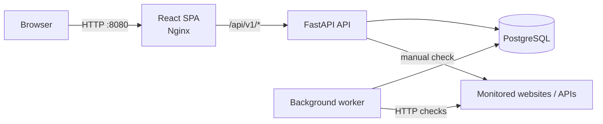

# StillUp

StillUp is a lightweight, self-hosted uptime monitoring application for websites and HTTP APIs. It periodically checks configured resources, stores response history, tracks incidents, calculates uptime statistics, and presents the current state in a React dashboard.

Current project version: **0.1.0**

## What StillUp can do

- Register, sign in, and sign out users.
- Store authentication in an HttpOnly JWT cookie.
- Create and manage website or API monitors.
- Run `GET` or `HEAD` checks.
- Configure check interval, timeout, redirect handling, and an expected HTTP status code.
- Run checks automatically in a separate background worker.
- Trigger a check manually from the application.
- Pause and resume monitoring.
- Use failure and recovery thresholds to reduce status flapping.
- Track monitor state as `unknown`, `up`, `degraded`, or `down`.
- Store response time, HTTP status, and check failures.
- Open and resolve incidents automatically.
- Show uptime and response-time statistics for `24h`, `7d`, and `30d` windows.
- Expose application/database health information.
- Run the complete stack with Docker Compose.

## Architecture



The frontend is built as a static Vite application and served by Nginx. In Docker, Nginx also proxies `/api/*` requests to FastAPI, so the browser can use a same-origin API path. The worker runs independently from the web API and performs scheduled checks against due monitors.

## Quick start with Docker

This is the easiest way to run the complete application.

### Requirements

You only need:

- Git
- Docker with Docker Compose support

### 1. Clone the repository

```bash
git clone https://github.com/kacpermielanczyk/Still_Up.git
cd Still_Up
```

### 2. Create the Docker environment file

Linux/macOS:

```bash
cp backend/.env.docker.example backend/.env.docker
```

PowerShell:

```powershell
Copy-Item backend/.env.docker.example backend/.env.docker
```

Open `backend/.env.docker` and replace at least these placeholders:

```env
DB_PASSWORD=replace-with-a-strong-database-password
POSTGRES_PASSWORD=replace-with-a-strong-database-password
JWT_SECRET=replace-with-a-long-random-docker-secret
```

`DB_PASSWORD` and `POSTGRES_PASSWORD` must contain the same value because the application and the PostgreSQL container need to agree on the database credentials.

Do not commit `backend/.env.docker`.

### 3. Build and start the stack

```bash
docker compose up --build
```

After startup:

- Application: `http://localhost:8080`
- Backend API: `http://localhost:8000`
- API health endpoint: `http://localhost:8000/api/v1/health`
- FastAPI documentation: `http://localhost:8000/docs`

The PostgreSQL service is intentionally not exposed to the host by the Compose configuration.

### 4. Check container status

```bash
docker compose ps
```

The expected services are:

- `frontend`
- `backend`
- `worker`
- `postgres`

### 5. Stop the application

```bash
docker compose down
```

Database data is preserved in the named `postgres_data` volume. To intentionally remove the database as well:

```bash
docker compose down -v
```

Use `-v` only when you actually want to delete local database data.

## How monitoring works

A monitor stores its URL, HTTP method, interval, timeout, expected response policy, and state thresholds.

If no exact status code is configured, StillUp considers HTTP `200-399` successful. If `expected_status_code` is set, only that exact response code is considered successful.

A single failed check does not necessarily make a monitor `down`. The state machine uses `failure_threshold` and `recovery_threshold` counters:

- failures below the configured threshold move the monitor to `degraded`;
- reaching the failure threshold moves it to `down`;
- successful recovery can pass through `degraded` before returning to `up`, depending on the recovery threshold.

When a monitor reaches `down`, StillUp creates an incident if one is not already open. When it returns to `up`, the open incident is resolved automatically.

## Project structure

```text
Still_Up/
├── backend/
│   ├── migrations/          # Alembic database migrations
│   ├── src/
│   │   ├── api/             # FastAPI routes and dependencies
│   │   ├── config/          # Settings, database, migrations
│   │   ├── models/          # SQLAlchemy models and enums
│   │   ├── repositories/    # Database access
│   │   ├── schemas/         # Pydantic request/response models
│   │   ├── services/        # Application/business logic
│   │   ├── utils/           # Security and HTTP checking logic
│   │   └── workers/         # Background monitor worker
│   └── tests/
├── frontend/
│   ├── public/
│   └── src/
│       ├── api/             # HTTP client and API modules
│       ├── components/      # Reusable and domain components
│       ├── contexts/        # Auth and theme providers
│       ├── hooks/           # TanStack Query hooks
│       ├── layouts/         # Application layouts
│       ├── pages/           # Route-level pages
│       ├── providers/       # Query provider
│       ├── types/           # API/domain TypeScript types
│       └── utils/           # Formatting helpers
├── docs/
├── compose.yaml
├── CHANGELOG.md
└── README.md
```

## Technology stack

| Area             | Technology                                            |
| ---------------- | ----------------------------------------------------- |
| Frontend         | React 19, TypeScript, Vite                            |
| Styling          | Tailwind CSS 4                                        |
| Server state     | TanStack Query                                        |
| Forms            | React Hook Form                                       |
| Routing          | React Router                                          |
| Backend          | Python 3.13, FastAPI                                  |
| ORM              | SQLAlchemy async                                      |
| Database         | PostgreSQL 17                                         |
| Migrations       | Alembic                                               |
| HTTP checks      | HTTPX                                                 |
| Authentication   | JWT in HttpOnly cookie, password hashing via `pwdlib` |
| Frontend runtime | Nginx unprivileged Alpine image                       |
| Containers       | Docker Compose                                        |
| Backend tests    | Pytest                                                |

## API overview

All application endpoints are prefixed with `/api/v1`.

| Method   | Endpoint                   | Purpose                               |
| -------- | -------------------------- | ------------------------------------- |
| `POST`   | `/auth/register`           | Create an account                     |
| `POST`   | `/auth/login`              | Sign in and set the auth cookie       |
| `POST`   | `/auth/logout`             | Clear the auth cookie                 |
| `GET`    | `/users/me`                | Return the authenticated user         |
| `GET`    | `/monitors`                | List the current user's monitors      |
| `POST`   | `/monitors`                | Create a monitor                      |
| `GET`    | `/monitors/{id}`           | Read one monitor                      |
| `PATCH`  | `/monitors/{id}`           | Update a monitor                      |
| `DELETE` | `/monitors/{id}`           | Delete a monitor                      |
| `POST`   | `/monitors/{id}/check`     | Run a manual check                    |
| `GET`    | `/monitors/{id}/checks`    | Read recent checks                    |
| `GET`    | `/monitors/{id}/incidents` | Read recent incidents                 |
| `GET`    | `/monitors/{id}/stats`     | Read `24h`, `7d`, or `30d` statistics |
| `GET`    | `/health`                  | Check API/database/migration health   |

Protected monitor endpoints only operate on resources owned by the authenticated user.

## Development without Docker

Docker Compose is the recommended first-run path. The frontend and backend can also be developed independently.

Frontend:

```bash
cd frontend
cp .env.example .env
npm ci
npm run dev
```

The Vite development server runs at `http://localhost:5173` by default.

Backend development requires Python, the dependencies from `requirements-dev.txt`, and a reachable PostgreSQL database matching `backend/.env`.

```bash
cd backend
python -m venv .venv
```

Activate the environment, then install development dependencies:

```bash
pip install -r requirements-dev.txt
```

Create `backend/.env` from `backend/.env.example`, configure PostgreSQL, and start the API:

```bash
uvicorn src.main:app --reload
```

Run the worker separately:

```bash
python -m src.workers.main
```

For detailed development notes, see the frontend and backend documentation linked below.

## Quality checks

Frontend:

```bash
cd frontend
npm run check
```

This runs ESLint, TypeScript type checking, and a production Vite build.

Backend:

```bash
cd backend
pytest
```

The current backend test suite covers schema validation, authentication/security helpers, monitor service behavior, worker behavior, route protection, health responses, and API route behavior.

## Environment and secrets

Real `.env` files are intentionally ignored by Git. Commit only the `.example` templates.

Important production changes include:

- use unique database credentials;
- use a long random JWT secret;
- set `COOKIE_SECURE=true` when the application is served over HTTPS;
- terminate TLS in a reverse proxy or deployment platform;
- review allowed frontend origins;
- do not publish PostgreSQL unless external database access is actually required.

## Documentation

- [Frontend architecture and development](docs/frontend.md)
- [Backend architecture and monitoring logic](docs/backend.md)
- [Docker and deployment model](docs/docker.md)
- [Versioning policy](docs/versioning.md)
- [Changelog](CHANGELOG.md)

## Project scope

StillUp is currently a compact self-hosted monitoring project rather than a replacement for a distributed production observability platform. The current architecture intentionally favors clear application boundaries and a small operational footprint over distributed scheduling, multi-region checks, or large-scale event processing.
