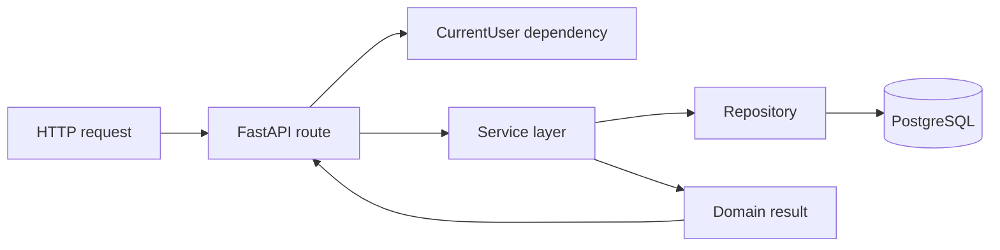
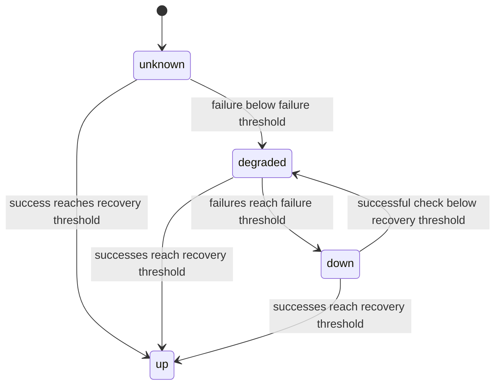

# Backend architecture

The StillUp backend is a FastAPI application using asynchronous SQLAlchemy and PostgreSQL. The API and monitoring worker are separate processes that share the same models, repositories, services, and database.

The architecture is intentionally layered without introducing a large framework abstraction around FastAPI.

## Stack

- Python 3.13
- FastAPI
- SQLAlchemy async
- asyncpg
- PostgreSQL 17
- Alembic
- HTTPX
- Pydantic Settings
- PyJWT
- pwdlib / Argon2-capable password hashing
- Pytest

The SQLAlchemy dependency should include its asyncio support so the runtime also receives the required `greenlet` dependency.

## Directory structure

```text
backend/
├── migrations/              # Alembic migrations
├── src/
│   ├── api/                 # HTTP routes and FastAPI dependencies
│   ├── config/              # Settings, engine, startup migration support
│   ├── models/              # SQLAlchemy entities and enums
│   ├── repositories/        # Database queries and persistence
│   ├── schemas/             # Pydantic request/response contracts
│   ├── services/            # Application/business logic
│   ├── utils/               # Security, HTTP checker, state calculation
│   ├── workers/             # Scheduled monitoring process
│   └── main.py              # FastAPI application entrypoint
└── tests/
    ├── api/
    └── unit/
```

## Layer responsibilities

### API

`src/api/` owns HTTP concerns:

- route paths and methods;
- request parameters;
- response models;
- dependency injection;
- authentication requirements;
- HTTP status codes.

Routes delegate application behavior to services instead of writing database queries directly.

### Schemas

`src/schemas/` defines request validation and response contracts using Pydantic.

Examples include:

- account email/password validation;
- valid URL validation;
- monitor interval range (`10-3600` seconds);
- timeout range (`1-30` seconds);
- valid expected HTTP status range (`100-599`);
- failure/recovery thresholds (`1-10`).

### Services

`src/services/` owns workflows and business rules.

For example, `MonitorService` coordinates ownership checks, repositories, statistics, monitor updates, and manual checks. `MonitorCheckService` executes a single monitor check, updates state, persists the check, and manages incidents.

### Repositories

`src/repositories/` contains persistence queries. Keeping SQLAlchemy queries here gives services a smaller interface and prevents route handlers from becoming tightly coupled to database implementation details.

### Models

`src/models/` contains SQLAlchemy entities for:

- users;
- monitors;
- monitor checks;
- incidents.

### Utilities

`src/utils/` contains focused domain helpers such as:

- JWT/password handling;
- HTTP request execution;
- monitor state calculation.

### Worker

`src/workers/main.py` is a separate long-running process that schedules due monitors. It imports the same repository/service layer as the API instead of duplicating monitoring logic.

## Request flow

A typical authenticated monitor request follows:



Ownership checks use both the monitor ID and authenticated user ID. A user therefore cannot retrieve another user's monitor simply by knowing its numeric ID.

## Authentication

Registration hashes the password before persistence. Login verifies the password and creates a JWT with:

- `sub` containing the user ID;
- `iat` issued-at timestamp;
- `exp` expiration timestamp.

FastAPI sends the token as an `access_token` cookie with:

- `HttpOnly` enabled;
- `SameSite=Lax`;
- configurable `Secure` flag;
- configured expiration;
- path `/`.

Protected routes read the cookie through the `CurrentUser` dependency, decode the JWT, load the user, and reject missing, expired, invalid, inactive, or unknown accounts.

The frontend never needs direct access to the JWT value.

## Monitor model

A monitor stores both configuration and its latest derived state.

Important configuration fields include:

| Field | Purpose |
| --- | --- |
| `resource_type` | `website` or `api` |
| `url` | Resource to request |
| `method` | `GET` or `HEAD` |
| `interval_seconds` | Delay between scheduled checks |
| `timeout_seconds` | Per-request timeout |
| `expected_status_code` | Optional exact successful HTTP status |
| `follow_redirects` | Whether HTTP redirects are followed |
| `enabled` | Whether the worker should schedule checks |
| `failure_threshold` | Failures required before `down` |
| `recovery_threshold` | Successes required to recover to `up` |

Latest state fields include:

- current monitor status;
- consecutive failures and successes;
- last HTTP status;
- last response time;
- last check timestamp;
- next scheduled check timestamp.

An index on `(enabled, next_check_at)` supports the worker's due-monitor lookup.

## HTTP check behavior

`check_http_resource()` uses `httpx.AsyncClient` and records elapsed time in milliseconds.

Success rules:

- if `expected_status_code` is set, the response must exactly match it;
- otherwise, any status from `200` through `399` is considered successful.

Handled request failures include:

- timeout;
- connection error;
- other HTTPX request errors;
- unexpected HTTP status.

Each result can store an error type and message for later inspection.

## Monitor state machine

The state machine prevents a single transient request from immediately toggling a monitor between healthy and unhealthy states.



On success:

- consecutive failures reset to `0`;
- consecutive successes increment;
- reaching `recovery_threshold` sets `up`;
- while recovering from `down`, insufficient successes produce `degraded`.

On failure:

- consecutive successes reset to `0`;
- consecutive failures increment;
- reaching `failure_threshold` sets `down`;
- otherwise the state is `degraded`.

## Incidents

Incident lifecycle is driven by the resulting monitor state.

When a monitor becomes `down` and has no open incident, a new incident is created. Its cause is derived from the HTTP error type or unexpected status.

When a monitor becomes `up` and has an open incident, that incident is marked `resolved` and receives `resolved_at`.

This means incidents represent periods of confirmed downtime rather than every individual failed check.

## Scheduled worker

The worker is deliberately separate from the FastAPI web process.

Every `WORKER_POLL_SECONDS` it:

1. reads a batch of enabled monitors whose `next_check_at` is due or missing;
2. limits the batch with `WORKER_BATCH_SIZE`;
3. checks monitors concurrently behind an `asyncio.Semaphore` capped by `WORKER_CONCURRENCY`;
4. persists check/state/incident changes;
5. schedules the next check as `now + interval_seconds`.

A worker-side check calls the shared check service with `reschedule=True`.

A manual API check calls the same service with `reschedule=False`, so manually checking a monitor does not move its existing worker schedule.

### Why the worker is a separate process

Running the scheduler separately avoids coupling periodic work to a specific Uvicorn process. The API can be restarted or scaled independently from the monitoring loop, while both processes reuse the same domain logic and database.

For the current project size, a PostgreSQL-backed due-monitor query plus in-process asyncio concurrency keeps the architecture understandable without introducing Redis/Celery or a separate message broker.

## Statistics

Statistics are calculated from stored checks for one of three supported periods:

- `24h`
- `7d`
- `30d`

Returned metrics include:

- uptime percentage;
- average response time;
- minimum response time;
- maximum response time;
- total checks;
- successful checks;
- failed checks;
- incidents started during the selected period.

Uptime is currently check-based:

```text
successful checks / total checks * 100
```

It is not duration-weighted availability.

## API endpoints

All routes are mounted below the configurable API prefix, currently `/api/v1`.

### Authentication

```text
POST /api/v1/auth/register
POST /api/v1/auth/login
POST /api/v1/auth/logout
GET  /api/v1/users/me
```

### Monitors

```text
GET    /api/v1/monitors
POST   /api/v1/monitors
GET    /api/v1/monitors/{id}
PATCH  /api/v1/monitors/{id}
DELETE /api/v1/monitors/{id}
```

### Monitoring data

```text
POST /api/v1/monitors/{id}/check
GET  /api/v1/monitors/{id}/checks?limit=...
GET  /api/v1/monitors/{id}/incidents?limit=...
GET  /api/v1/monitors/{id}/stats?period=24h|7d|30d
```

### Health

```text
GET /api/v1/health
```

The health endpoint executes a database query and reads the current Alembic revision. On database failure it responds with HTTP `503`.

## Database migrations

Alembic manages schema changes under `backend/migrations/`.

When `AUTO_MIGRATE=true`, FastAPI applies migrations to `head` during application startup before accepting normal traffic.

For this compact self-hosted project that is a pragmatic default. In a larger multi-instance production deployment, migration execution would normally become an explicit release/deployment step rather than every API instance being allowed to run it.

Manual migration commands:

```bash
alembic upgrade head
```

Create a migration after model changes:

```bash
alembic revision --autogenerate -m "describe change"
```

Always review autogenerated migrations before committing them.

## Configuration

Settings are loaded by Pydantic Settings. Important variables include:

| Variable | Purpose |
| --- | --- |
| `APP_NAME` | FastAPI application name |
| `APP_ENV` | Environment label |
| `DEBUG` | Debug/SQL logging behavior |
| `VERSION` | Application version |
| `API_PREFIX` | REST API prefix |
| `FRONTEND_URL` | Allowed browser origin |
| `DB_*` | Database connection |
| `AUTO_MIGRATE` | Run Alembic on API startup |
| `WORKER_POLL_SECONDS` | Worker polling cadence |
| `WORKER_BATCH_SIZE` | Due monitors fetched per loop |
| `WORKER_CONCURRENCY` | Maximum simultaneous checks |
| `JWT_SECRET` | JWT signing secret |
| `JWT_ALGORITHM` | JWT signing algorithm |
| `ACCESS_TOKEN_EXPIRE_MINUTES` | Auth token lifetime |
| `COOKIE_SECURE` | Require HTTPS for auth cookie |

Local host development uses `backend/.env`. Docker Compose injects `backend/.env.docker` directly into containers.

## Local development

Create a virtual environment:

```bash
cd backend
python -m venv .venv
```

Activate it and install development dependencies:

```bash
pip install -r requirements-dev.txt
```

Create `.env` from the example and configure a local PostgreSQL database:

Linux/macOS:

```bash
cp .env.example .env
```

PowerShell:

```powershell
Copy-Item .env.example .env
```

Start the API:

```bash
uvicorn src.main:app --reload
```

Start the worker in another terminal:

```bash
python -m src.workers.main
```

## Tests

Install development dependencies, then run:

```bash
pytest
```

Current tests cover areas including:

- Pydantic validation;
- password hashing and JWT decoding;
- monitor ownership behavior;
- monitor creation/update/statistics service logic;
- worker due-monitor handling;
- authentication route behavior;
- protected monitor routes;
- monitor CRUD/check/history/stat route contracts;
- database health response behavior.

The API tests primarily use FastAPI dependency overrides and mocks for service/database boundaries, so they remain fast and focused.

## Current backend boundaries

- Scheduled checks are executed from one worker process; distributed worker coordination is not implemented.
- Monitoring currently targets HTTP(S) resources through `GET` and `HEAD`.
- Uptime percentage is check-count based rather than duration weighted.
- History endpoints currently use a `limit` instead of cursor/offset pagination metadata.
- Alert delivery channels are not part of version `0.1.0`.
