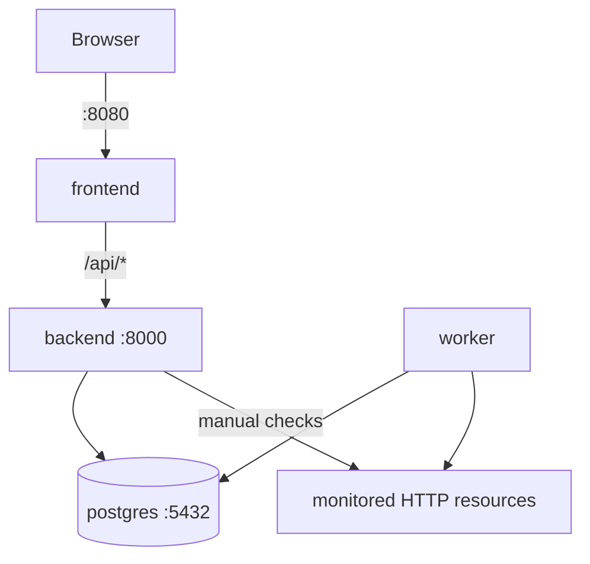

# Docker and deployment model

StillUp ships with one root `compose.yaml` that runs the application as four services:

```text
frontend  -> React build served by Nginx
backend   -> FastAPI/Uvicorn
worker    -> same backend image, different command
postgres  -> PostgreSQL 17
```

## Service topology



Only ports needed by a developer are published:

- frontend: `8080` on all host interfaces;
- backend: `8000` bound to `127.0.0.1`;
- PostgreSQL: not published.

The worker has no published port.

## Why the images are structured this way

### Frontend

The frontend Dockerfile is multi-stage.

Builder:

```text
node:22.22-alpine
```

It runs `npm ci` and `npm run build`.

Runtime:

```text
nginxinc/nginx-unprivileged:1.27-alpine
```

Only the generated `dist` directory and Nginx configuration enter the runtime image. The final container does not need Node.js source dependencies or the development server.

### Backend

The backend Dockerfile also uses two stages.

The builder creates a virtual environment and installs Python runtime dependencies. The runtime stage starts again from `python:3.13-slim`, copies only the virtual environment, migrations, Alembic configuration, and application source, and runs as a non-root `app` user.

This keeps build-time package work separate from runtime application files.

### Worker

The worker does not build another Python image. It reuses:

```text
still-up-backend:local
```

and replaces the default command with:

```text
python -m src.workers.main
```

This avoids maintaining two images containing the same Python code and dependencies.

### PostgreSQL

PostgreSQL uses the Alpine image and persists data in the named `postgres_data` volume.

## Environment setup

Compose expects:

```text
backend/.env.docker
```

Create it from:

```text
backend/.env.docker.example
```

The file contains both application database variables and PostgreSQL bootstrap variables.

Keep these pairs synchronized:

```env
DB_NAME=stillup
POSTGRES_DB=stillup

DB_USER=stillup
POSTGRES_USER=stillup

DB_PASSWORD=<same password>
POSTGRES_PASSWORD=<same password>
```

Also replace `JWT_SECRET` with a long random value.

The real `.env.docker` file is ignored by Git and should never be committed.

## Start the stack

```bash
docker compose up --build
```

Run detached:

```bash
docker compose up --build -d
```

## Inspect status

```bash
docker compose ps
```

Inspect all logs:

```bash
docker compose logs -f
```

One service only:

```bash
docker compose logs -f backend
```

Equivalent service names are `frontend`, `worker`, and `postgres`.

## Rebuild only application services

Frontend:

```bash
docker compose build --no-cache frontend
docker compose up -d frontend
```

Backend and worker image:

```bash
docker compose build --no-cache backend
docker compose up -d backend worker
```

Because backend and worker reuse the same image name, a backend dependency/source rebuild also supplies the worker runtime image.

## Health checks

### PostgreSQL

Compose runs `pg_isready` using the configured database user/database.

The backend waits for PostgreSQL to become healthy.

### Backend

The backend container calls:

```text
http://127.0.0.1:8000/api/v1/health
```

The health endpoint verifies database access and reads the Alembic revision.

The worker waits for the backend health check before starting.

### Frontend

Nginx exposes an internal lightweight health endpoint:

```text
/healthz
```

Compose uses it to verify the frontend container.

## Nginx behavior

The frontend runtime configuration has three main responsibilities.

### SPA routing

Unknown application paths fall back to `index.html`, allowing React Router routes such as `/monitors/123` to work on a direct browser refresh.

### API reverse proxy

Requests under:

```text
/api/
```

are proxied to:

```text
http://backend:8000
```

The Vite build therefore receives:

```text
VITE_API_URL=/api/v1
```

The browser does not need to know the Docker service name.

### Static asset caching

Generated assets under `/assets/` are served with long-lived immutable caching. `index.html` is not long-term cached, which allows new builds to reference updated hashed assets.

## Persistent data

Database files live in:

```text
postgres_data
```

Normal shutdown preserves it:

```bash
docker compose down
```

Delete containers and database volume:

```bash
docker compose down -v
```

Do not use `-v` if the local database contains data you want to keep.

## Useful reset commands

Recreate application containers while preserving data:

```bash
docker compose down
docker compose up --build
```

Full local reset including PostgreSQL data:

```bash
docker compose down -v
docker compose up --build
```

## Troubleshooting

### PostgreSQL says no superuser password was provided

`backend/.env.docker` is missing or `POSTGRES_PASSWORD` is empty. Create the file from `.env.docker.example` and provide database credentials.

If the database was only partially initialized and contains no data you need, reset the volume with:

```bash
docker compose down -v
```

then start again.

### SQLAlchemy asyncio reports missing `greenlet`

Ensure the backend requirements install SQLAlchemy with asyncio support, for example:

```text
SQLAlchemy[asyncio]>=2.0,<3.0
```

Then rebuild the backend image without cache:

```bash
docker compose build --no-cache backend
docker compose up
```

### Frontend opens but API requests fail

Check:

```bash
docker compose ps
docker compose logs backend
docker compose logs frontend
```

In Docker the frontend should be built with `/api/v1`, not with `http://backend:8000`. The browser cannot resolve Docker service names; Nginx handles that internal hop.

## Production considerations

The current Compose setup is suitable for local use, demonstrations, and small self-hosted deployments, but internet-facing deployment should additionally consider:

- TLS termination;
- `COOKIE_SECURE=true`;
- strong unique secrets stored outside the repository;
- backups for PostgreSQL;
- resource limits and log retention;
- explicit domain/origin configuration;
- a deliberate migration release process if multiple backend replicas are introduced;
- external monitoring of StillUp itself;
- network/firewall rules appropriate for the deployment environment.

The database is intentionally not exposed by default. Keep it private unless there is a concrete operational reason to publish its port.
