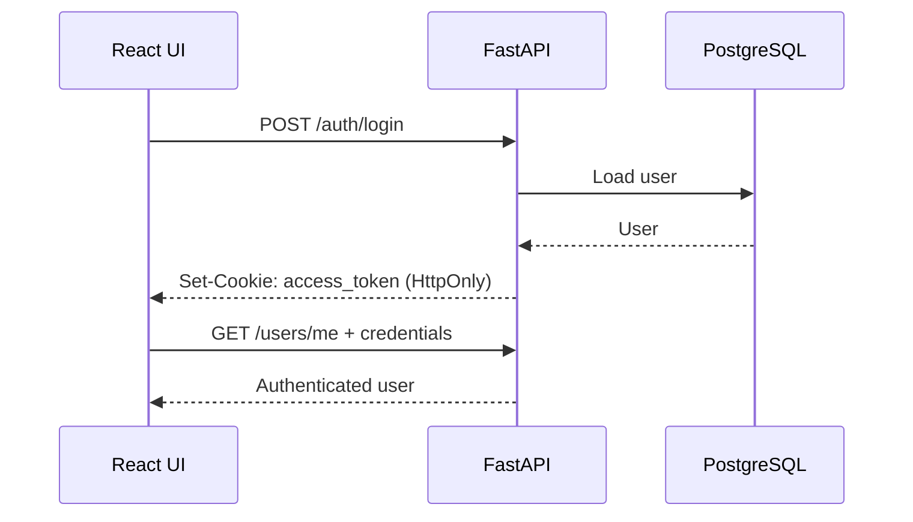

# Frontend architecture

The StillUp frontend is a React + TypeScript single-page application built with Vite. It is responsible for authentication UI, monitor management, dashboards, monitor detail views, and presenting data returned by the FastAPI backend.

The frontend does not own server data. TanStack Query is the source of truth for API state, while local React state is reserved for UI state such as open modals, filters, selected statistics period, and pagination.

## Stack

- React 19
- TypeScript 6
- Vite 8
- React Router
- TanStack Query
- React Hook Form
- Tailwind CSS 4
- Lucide React icons

## Directory structure

```text
frontend/src/
├── api/
│   ├── client.ts            # Shared fetch wrapper
│   ├── auth.api.ts          # Authentication requests
│   ├── monitors.api.ts      # Monitor/check/incident/stat requests
│   ├── health.api.ts        # Health endpoint
│   ├── query-client.ts      # TanStack Query client
│   └── query-keys.ts        # Central query key factory
├── components/
│   ├── dashboard/           # Dashboard-specific sections
│   ├── forms/               # Auth and monitor forms
│   ├── inputs/              # Reusable form controls
│   ├── menu/                # Navigation/menu components
│   ├── modals/              # Drawer/modal composition
│   ├── monitor-details/     # Monitor detail sections
│   ├── monitors/            # Monitor cards, filters, chart, badges
│   ├── navigation/          # Pagination
│   ├── routing/             # Route guards
│   ├── switches/            # Theme switch
│   └── tiles/               # Reusable dashboard surfaces
├── contexts/                # Auth and theme providers
├── hooks/
│   ├── auth/
│   ├── health/
│   └── monitors/
├── layouts/                 # Auth and application layouts
├── pages/                   # Route-level page composition
├── providers/               # Query provider
├── types/                   # Shared API/domain types
└── utils/                   # Formatting helpers
```

## Application bootstrap

`App.tsx` composes providers in this order:

```text
QueryProvider
└── ThemeProvider
    └── AuthProvider
        └── RouterProvider
```

This order is intentional:

- TanStack Query must be available before authentication hooks can query the current user.
- Theme state is application-wide and independent from routing.
- Authentication state must be available to route guards.
- The router is rendered last so every page can use the providers above it.

## Routing

The router currently exposes the following pages:

| Route | Access | Purpose |
| --- | --- | --- |
| `/login` | Public only | Sign in |
| `/register` | Public only | Create account |
| `/` | Authenticated | Dashboard |
| `/monitors` | Authenticated | Monitor list and management |
| `/monitors/:monitorId` | Authenticated | Monitor details |

`PublicOnlyRoute` prevents authenticated users from remaining on authentication pages. `ProtectedRoute` prevents unauthenticated users from opening application routes.

## API client

All requests go through `src/api/client.ts`.

The client is intentionally small and centralizes behavior that should be consistent across the application:

- API base URL comes from `VITE_API_URL`;
- JSON request bodies are serialized automatically;
- JSON and non-JSON responses are parsed safely;
- `204 No Content` is handled without attempting JSON parsing;
- `credentials: "include"` is always enabled so the HttpOnly authentication cookie is sent;
- backend errors are normalized into `ApiError`;
- `AbortSignal` is supported so TanStack Query can cancel obsolete requests.

Feature-specific modules such as `auth.api.ts` and `monitors.api.ts` contain endpoint calls but no UI behavior.

## Server state with TanStack Query

TanStack Query is used for all data fetched from the backend. Query keys are centralized in `query-keys.ts`, which makes invalidation predictable after mutations.

Current refresh behavior:

| Data | Automatic refresh |
| --- | ---: |
| Monitor list | 10 seconds |
| Monitor details | 10 seconds |
| Check history | 10 seconds |
| Incident history | 15 seconds |
| Statistics | 30 seconds |
| API health | 30 seconds |

This polling model is a deliberate fit for the current scale of the application. It avoids WebSocket/SSE complexity while still keeping the UI reasonably fresh for uptime-monitoring data.

A future version can replace or supplement polling if real-time event delivery becomes useful.

## Authentication flow

The backend stores the access token in an HttpOnly cookie. JavaScript never reads or writes the token directly.



The auth context is a convenience layer around authentication hooks; it is not a second server-state store. This prevents duplicated user state and keeps TanStack Query responsible for cache freshness.

## Monitor UI flow

The monitor list page provides:

- text search by monitor name or URL;
- status filtering;
- resource-type filtering;
- client-side pagination;
- create, edit, and delete actions through drawer modals.

The monitor detail page composes independent sections for:

- header and actions;
- summary metrics;
- response-time visualization;
- current monitor state;
- statistics period selection;
- monitor configuration;
- check history;
- incident history.

The detail page requests a larger recent history (`100` checks and `50` incidents) and paginates the returned arrays in the UI.

### Why pagination is client-side today

The backend currently returns arrays and supports only a `limit` parameter for histories. Keeping pagination client-side avoids pretending there is server pagination when there is not.

If the API later adds `page`, `offset`, cursor, or total-count metadata, the existing pagination UI can stay while its data source moves server-side.

## Forms and mutations

React Hook Form handles form state and validation for authentication and monitor forms.

Monitor mutations use dedicated hooks for:

- create;
- update;
- delete;
- manual check.

After a successful mutation, relevant TanStack Query caches are invalidated or refreshed rather than maintaining a separate hand-written local copy of server state.

## UI composition

The frontend is organized around small domain components rather than large route components.

Pages are primarily orchestrators. For example, the monitor page is responsible for loading queries and wiring actions, while components under `components/monitor-details/` own presentation of each section.

Generic UI elements such as `Tile`, `Button`, `Input`, `Select`, `Checkbox`, `Modal`, and `Pagination` are kept separate from monitor-specific UI.

This keeps reusable components generic and avoids coupling basic UI primitives to TanStack Query or monitor domain types.

## Styling and themes

Tailwind CSS is used for layout and component styling. Application colors are exposed through CSS variables in `src/index.css`, which allows the same semantic classes to work across light and dark themes.

The visual system distinguishes semantic state colors from brand accents:

- success is reserved for healthy/positive monitor state;
- warning is reserved for degraded/attention state;
- danger is reserved for failures;
- primary/accent colors are used for interaction and branding.

## Local development

Create the local Vite environment file:

Linux/macOS:

```bash
cd frontend
cp .env.example .env
```

PowerShell:

```powershell
cd frontend
Copy-Item .env.example .env
```

Default local configuration:

```env
VITE_API_URL=http://localhost:8000/api/v1
```

Install dependencies and start Vite:

```bash
npm ci
npm run dev
```

The development frontend is normally available at `http://localhost:5173`.

The backend must allow that origin through `FRONTEND_URL` and must be reachable at the configured API URL.

## Validation commands

Run all frontend quality checks:

```bash
npm run check
```

Equivalent individual commands:

```bash
npm run lint
npm run typecheck
npm run build
```

`npm run check` is the preferred pre-commit/pre-release command because it verifies lint rules, TypeScript, and the production Vite build.

## Docker runtime

The frontend Dockerfile uses two stages:

1. `node:22.22-alpine` builds the Vite application.
2. `nginxinc/nginx-unprivileged:1.27-alpine` serves only the generated `dist` output.

Node.js, the source tree, and `node_modules` are not required in the final runtime image.

In Docker, the build receives:

```text
VITE_API_URL=/api/v1
```

Nginx proxies `/api/` to the backend service. This keeps browser requests same-origin and avoids exposing Docker-internal service names to the frontend bundle.

## Adding a new frontend feature

A typical API-backed feature should follow this path:

```text
Type definitions
    ↓
API function
    ↓
Query key
    ↓
Query/mutation hook
    ↓
Domain component
    ↓
Page composition
```

Keep backend communication out of presentational components when possible. Components should receive data and callbacks; hooks should own fetching and mutation behavior.

## Current frontend boundaries

- History/list pagination is currently client-side.
- Data freshness is polling-based rather than pushed from the server.
- There is currently no dedicated frontend automated test suite in the repository.
- The frontend is designed around the existing REST API and cookie authentication model.
